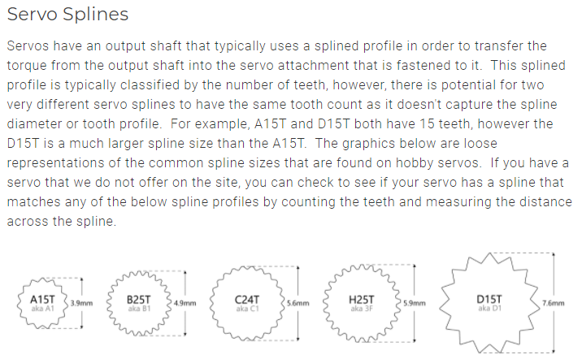

# Servo Measurements

This document describes the various measurements that can be obtained from servo models using this library.

## Measurement Descriptions

### Height measurements

(side view of motor)

```text
                                          V
       ===============  --------------------
             | | <- Axle Height          Horn Height (Axle height included)
    --------------      ---              ---
   |              |      Fore Height      ^
===|              |=== <- Wing Height     |
   |              |      ^               Body Height (sum)
   |              |      | Aft Height     |
   |              |      V                V
    --------------      ---              ---
```

### Width measurements and axle offset

(side view of motor)

```text
          Axle Offset (distance from center of axle to center of servo)
           |<>|
       ===============
             | |
    --------------
   |              |
===|              |===
   |              |
   |              |
   |              |
    --------------
   |<-Body Width->|
|<----Wing Width---->|
```

### Length measurements and axle diameter

(front view of motor)

```text
================
    ->| |<- Axle Diameter
   ---------
  |         |
  |=========|
  |         |
  |         |
  |         |
   ---------
  |<------->|
  Body Length
```

### Screw hole measurements

(top view of motor)

```text
 -------
|   O   | ---
|-------|  ^
|       |  | <- Screw Y Offset (distance from center of motor)
|       |  V
|       | ---
|       |
|       |
|-------|
|   O   |
 -------
    |<-->| <- Screw X Offset (distance from center of motor)
```

## Visual Diagram



## Measurement Functions

See the [API Reference](api.md) for detailed information about functions that return these measurements.
